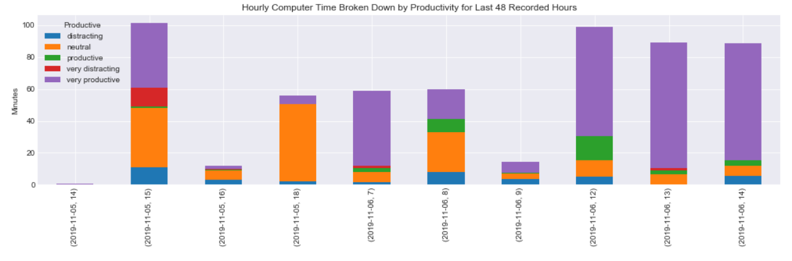
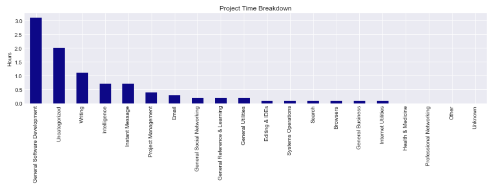
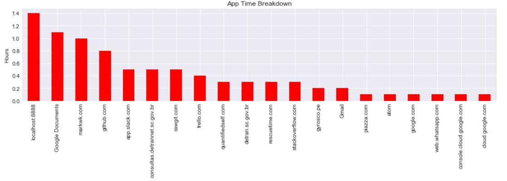
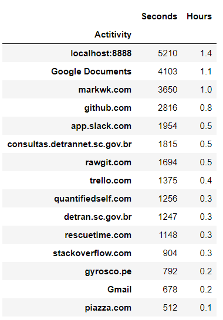

# RescueTime

Download and Visualize Computer Usage Data from RescueTime

### Dependencies

Use of this project requires Python 3 with the following dependencies installed:
  - pandas
  - numpy
  - matplotlib

### File Descriptions

- credentials-sample.json - json file to store your RescueTime API key
- rescuetimedownloader.py - Python file to download your RescueTime data
- rescuetime_data_analysis.ipynb - Jupyter notebook to visualize your RescueTime data

### How to Download and Analyze your RescueTime Data.

*** If you don’t already have a RescueTime account. Create one today and then come back tomorrow or at another time so you have some data to download. (https://www.rescuetime.com/get_rescuetime)

### Setup

1. Download the 3 files included in this repo:
  - credentials-sample.json 
  - rescuetimedownloader.py
  - rescuetime_data_analysis.ipynb

2. Go to the RescueTime API page and copy your API Key (https://www.rescuetime.com/anapi/manage)

3. Rename credentials-sample.json to credentials.json and add your RescueTime Key.

4. Make sure you have the 3 needed files in the same directory:
  - credentials.json (with your KEY)
  - rescuetimedownloader.py
  - rescuetime_data_analysis.ipynb

### Download 

5. Run the python script from the command line. This will download and organize the data for use in analysis.

### Analyze

6. Open the jupyter notebook and create visualizations.

### Sample Visualizations

### Acknowledgements

https://github.com/markwk/qs_ledger/tree/master/rescuetime

